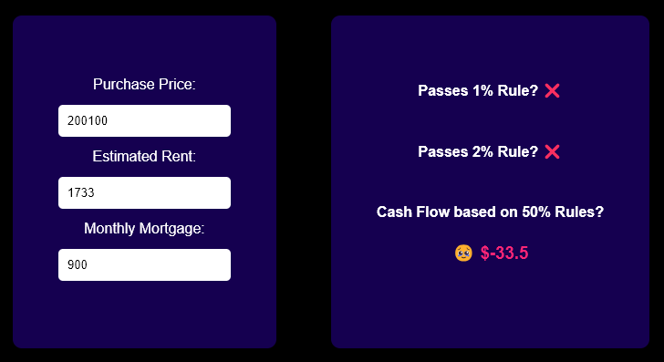
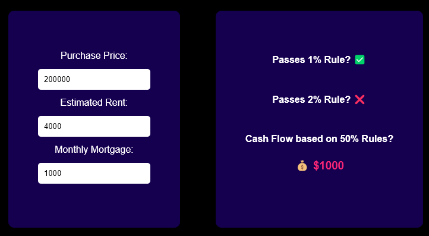
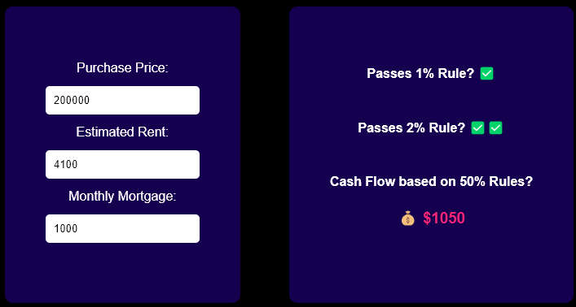

# Rental Investor Calculator

Minimalist React based calculator for rental property investors.

# Features
Quick go-no-go on rental property investments in seconds!!

Just enter the purchase price, desired rent, and monthly mortgage and the calculator will tell you if it's a good deal or not.

# Scoring system

## ❌ Flop! Run Away!
It doesn't pass the 1% or 2% rule and it doesn't cash flow. Run away!
<!-- image -->

## ✅ Good. Look into it a little more.
It passes the 1% rule but not the 2% rule. It's cash flow is great so maybe not passing the 2% rule is ok.
<!-- image --> 

## ✅ ✅ Why are you still reading this! 
It passes the 2% rule and cash flows. Seems like a strong investment.
<!-- image --> 

## Rules used
In the book "How to invest in Real Estate" by Joshua Dorkin and Brandon Turner, they recommend the following rules for rental property investors:
- 1 percent rule
-- If the monthly rent is at least 1 percent of the purchase price, then it's a good deal.
- 2 percent rule
-- If the monthly rent is at least 2 percent of the purchase price, then it's a great deal.
- 50 percent rule
-- Cash flow will roughly your monthly divided in half minus the cost of your monthly mortage.

# How to run locally

## pre-requisites
- `Node.js v16^`
- `npm`

## Installation steps
1. Clone the repo `git clone {repo url}`
2. Run `npm install`
3. Run `npm run dev`

### Note!
This calculator does not guarantee success in your real estate investing endeavors. It is merely a tool to help you make a decision. Please do your own due diligence before making any investment decisions.

#### references
<!-- table of references -->
| Reference | Link |
| --------- | ---- |
| How to invest in Real Estate (by Joshua Dorkin and Brandon Turner) | https://store.biggerpockets.com/products/how-to-invest-in-real-estate |